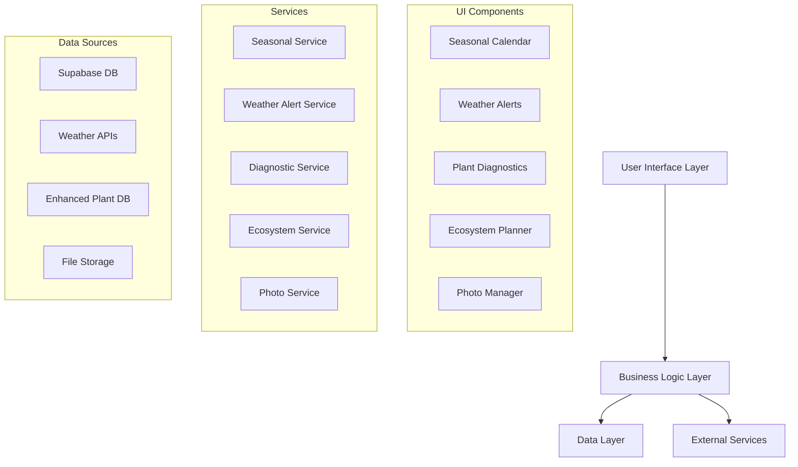

# Design Document

## Overview

The Comprehensive Garden Companion transforms the existing gardening application into a daily companion for balcony and small-space gardening. The design builds upon the current React/Next.js architecture with Supabase backend, adding new services and components for seasonal guidance, weather alerts, plant diagnostics, enhanced plant data, photo management, and ecosystem planning.

## Architecture

### High-Level Architecture



### System Integration

The design extends the existing GardenContext to include new services while maintaining backward compatibility. New features integrate with the current plant management system and leverage existing weather service infrastructure.

## Components and Interfaces

### 1. Seasonal Guide System

**Components:**
- `SeasonalDashboard`: Main seasonal guidance interface
- `MonthlyTaskList`: Month-specific gardening tasks
- `SeasonalCalendar`: Visual calendar with task scheduling
- `TaskReminder`: Notification system for seasonal activities

**Key Interfaces:**
```typescript
interface SeasonalTask {
  id: string;
  title: string;
  description: string;
  month: number;
  priority: 'high' | 'medium' | 'low';
  category: 'planting' | 'maintenance' | 'harvesting' | 'preparation';
  climateZone: string;
  plantTypes?: string[];
}

interface SeasonalGuide {
  currentMonth: SeasonalTask[];
  upcomingTasks: SeasonalTask[];
  seasonalTips: string[];
}
```

### 2. Weather Alert System

**Components:**
- `WeatherAlertBanner`: Prominent alert display
- `WeatherActionModal`: Detailed protection recommendations
- `AlertHistory`: Past alerts and actions taken

**Key Interfaces:**
```typescript
interface WeatherAlert {
  id: string;
  type: 'yellow' | 'orange' | 'red';
  category: 'wind' | 'rain' | 'storm' | 'temperature';
  severity: number;
  startTime: string;
  endTime: string;
  description: string;
  recommendations: PlantProtectionAction[];
}

interface PlantProtectionAction {
  action: string;
  urgency: 'immediate' | 'within_hours' | 'prepare';
  plantTypes: string[];
  instructions: string[];
}
```

### 3. Plant Care Diagnostic System

**Components:**
- `DiagnosticWizard`: Step-by-step symptom identification
- `SymptomSelector`: Visual symptom selection interface
- `TreatmentPlan`: Detailed care recommendations
- `PotRecommendations`: Pot size and type suggestions

**Key Interfaces:**
```typescript
interface PlantSymptom {
  id: string;
  name: string;
  category: 'leaves' | 'stems' | 'roots' | 'growth';
  description: string;
  imageUrl?: string;
}

interface DiagnosticResult {
  possibleCauses: PlantIssue[];
  recommendedActions: CareAction[];
  potRecommendations?: PotRecommendation[];
  followUpSchedule: string[];
}

interface PotRecommendation {
  size: string;
  material: 'terracotta' | 'ceramic' | 'plastic' | 'fabric';
  drainage: boolean;
  reasoning: string;
}
```

### 4. Enhanced Plant Database

**Components:**
- `PlantDetailView`: Comprehensive plant information display
- `PlantSearch`: Advanced search with filters
- `PlantComparison`: Side-by-side plant comparison
- `CareScheduleGenerator`: Automated care calendar creation

**Enhanced Plant Interface:**
```typescript
interface EnhancedPlant extends Plant {
  // Existing fields plus:
  category: 'fruit' | 'vegetable' | 'herb' | 'flower';
  nativeRegion: string;
  companionPlants: string[];
  pollinatorFriendly: boolean;
  harvestInfo?: HarvestInfo;
  seasonalCare: SeasonalCareGuide;
  commonIssues: PlantIssue[];
  soilRequirements: SoilRequirements;
}

interface HarvestInfo {
  season: string[];
  timeToHarvest: string;
  harvestSigns: string[];
  storageInstructions: string;
}
```

### 5. Photo Management System

**Components:**
- `PhotoUploader`: Drag-and-drop photo upload
- `PhotoGallery`: Plant photo timeline
- `ImageOptimizer`: Automatic image processing
- `FallbackImageProvider`: Default plant images

**Key Interfaces:**
```typescript
interface PlantPhoto {
  id: string;
  plantId: string;
  url: string;
  thumbnailUrl: string;
  uploadDate: string;
  isPrimary: boolean;
  metadata?: PhotoMetadata;
}

interface PhotoMetadata {
  size: number;
  dimensions: { width: number; height: number };
  format: string;
  captureDate?: string;
}
```

### 6. Ecosystem Planning System

**Components:**
- `EcosystemAnalyzer`: Current garden ecosystem analysis
- `CompanionPlantSuggestions`: Recommended companion plants
- `PollinatorGarden`: Pollinator-focused recommendations
- `SpaceOptimizer`: Balcony space planning tool

**Key Interfaces:**
```typescript
interface EcosystemAnalysis {
  currentPlants: EcosystemPlant[];
  missingElements: EcosystemGap[];
  recommendations: CompanionRecommendation[];
  pollinatorScore: number;
}

interface CompanionRecommendation {
  plantId: string;
  benefits: string[];
  compatibility: number;
  spaceRequirement: string;
  seasonalTiming: string;
}
```

## Data Models

### Database Schema Extensions

**New Tables:**
```sql
-- Seasonal tasks and guidance
CREATE TABLE seasonal_tasks (
  id UUID PRIMARY KEY DEFAULT gen_random_uuid(),
  title TEXT NOT NULL,
  description TEXT,
  month INTEGER NOT NULL,
  priority TEXT CHECK (priority IN ('high', 'medium', 'low')),
  category TEXT CHECK (category IN ('planting', 'maintenance', 'harvesting', 'preparation')),
  climate_zone TEXT DEFAULT 'ireland',
  plant_types TEXT[],
  created_at TIMESTAMP DEFAULT NOW()
);

-- Weather alerts and user responses
CREATE TABLE weather_alerts (
  id UUID PRIMARY KEY DEFAULT gen_random_uuid(),
  user_id UUID REFERENCES auth.users(id),
  alert_type TEXT NOT NULL,
  severity TEXT NOT NULL,
  start_time TIMESTAMP NOT NULL,
  end_time TIMESTAMP,
  description TEXT,
  actions_taken TEXT[],
  created_at TIMESTAMP DEFAULT NOW()
);

-- Plant diagnostic history
CREATE TABLE plant_diagnostics (
  id UUID PRIMARY KEY DEFAULT gen_random_uuid(),
  plant_id UUID REFERENCES plants(id),
  symptoms TEXT[] NOT NULL,
  diagnosis TEXT,
  treatment_plan JSONB,
  resolved BOOLEAN DEFAULT FALSE,
  created_at TIMESTAMP DEFAULT NOW()
);

-- Enhanced plant database
CREATE TABLE plant_database_enhanced (
  id UUID PRIMARY KEY DEFAULT gen_random_uuid(),
  perenual_id INTEGER,
  category TEXT CHECK (category IN ('fruit', 'vegetable', 'herb', 'flower')),
  native_region TEXT,
  companion_plants TEXT[],
  pollinator_friendly BOOLEAN DEFAULT FALSE,
  harvest_info JSONB,
  seasonal_care JSONB,
  common_issues JSONB,
  soil_requirements JSONB,
  updated_at TIMESTAMP DEFAULT NOW()
);

-- Plant photos
CREATE TABLE plant_photos (
  id UUID PRIMARY KEY DEFAULT gen_random_uuid(),
  plant_id UUID REFERENCES plants(id),
  user_id UUID REFERENCES auth.users(id),
  url TEXT NOT NULL,
  thumbnail_url TEXT,
  is_primary BOOLEAN DEFAULT FALSE,
  metadata JSONB,
  created_at TIMESTAMP DEFAULT NOW()
);
```

### Enhanced Plant Data Structure

The existing plant database will be expanded with comprehensive information for Irish climate gardening, including:

- **Fruits**: Strawberries, raspberries, blueberries, apples (dwarf varieties)
- **Vegetables**: Potatoes, carrots, lettuce, spinach, kale, Brussels sprouts
- **Herbs**: Rosemary, thyme, sage, parsley, chives, mint
- **Flowers**: Chrysanthemums, pansies, primroses, daffodils, tulips

Each entry includes detailed care instructions, companion planting information, and seasonal guidance specific to Irish growing conditions.

## Error Handling

### Weather Service Resilience
- Fallback to cached weather data when APIs are unavailable
- Graceful degradation when location services are disabled
- User notification system for service interruptions

### Photo Upload Error Handling
- File size and format validation
- Automatic retry mechanism for failed uploads
- Fallback to default images when uploads fail
- Storage quota management and user notifications

### Diagnostic System Error Handling
- Validation of symptom combinations
- Fallback recommendations when specific diagnoses aren't available
- User feedback collection for improving diagnostic accuracy

## Testing Strategy

### Unit Testing
- **Services**: Weather alert processing, seasonal task generation, diagnostic algorithms
- **Components**: Photo upload functionality, symptom selection, recommendation display
- **Utilities**: Image processing, data validation, date calculations

### Integration Testing
- **Weather Integration**: Mock weather API responses and alert generation
- **Database Operations**: Plant data CRUD operations with enhanced fields
- **Photo Management**: End-to-end photo upload and display workflow

### User Acceptance Testing
- **Seasonal Guidance**: Verify month-appropriate task recommendations
- **Weather Alerts**: Test alert accuracy and action recommendations
- **Diagnostic Flow**: Validate symptom-to-treatment accuracy
- **Ecosystem Planning**: Verify companion plant recommendations

### Performance Testing
- **Photo Upload**: Large file handling and optimization
- **Database Queries**: Enhanced plant data retrieval performance
- **Weather API**: Response time and rate limiting
- **Mobile Responsiveness**: Touch interactions and loading times

## Security Considerations

### Photo Storage Security
- Secure file upload with virus scanning
- User-specific storage isolation
- Image metadata sanitization
- Storage quota enforcement

### Weather Data Privacy
- Location data handling and user consent
- Weather service API key protection
- User location data encryption

### Plant Data Integrity
- Input validation for diagnostic symptoms
- Sanitization of user-generated content
- Protection against malicious plant data injection

## Performance Optimization

### Image Optimization
- Automatic image compression and resizing
- Progressive loading for photo galleries
- CDN integration for faster image delivery
- Lazy loading for plant database images

### Data Caching
- Seasonal task caching with monthly updates
- Weather alert caching with smart refresh
- Plant database caching with version control
- User preference caching for faster load times

### Mobile Performance
- Optimized bundle sizes for mobile networks
- Touch-friendly interface design
- Offline capability for core features
- Progressive Web App (PWA) implementation